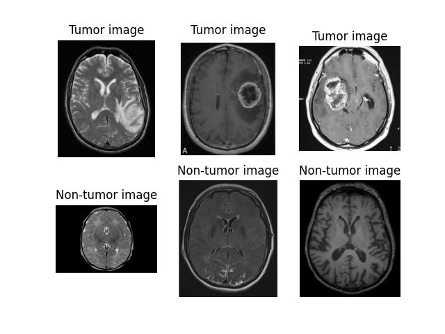
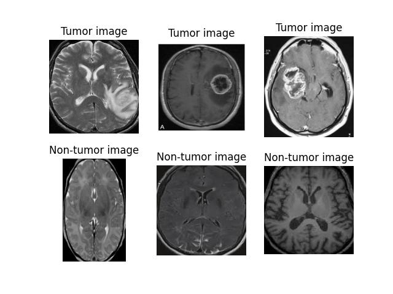
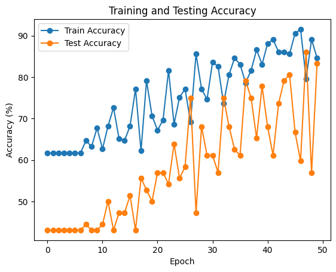
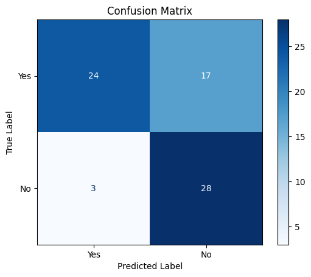
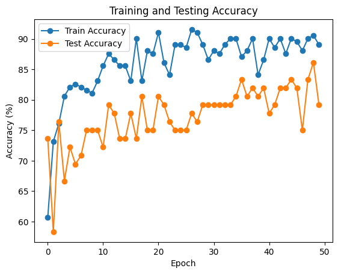
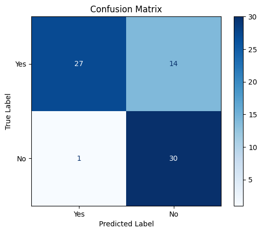

# Binary classification of brain tumors from MRIs.

## Authors and credits
* John "Frank" Burkhart: Responsible for binary classification code and manuscript write-up.
* Tom Blue: Created masks for semantic segmentation using LabelBox software
* Brian Manuel: Wrote code for semantic segmentation section

## Table of Contents
- [Introduction](#introduction)
- [Data Preprocessing and EDA](#data-preprocessing-and-eda)
- [Modeling](#modeling)
- [Directory Structure](#directory-structure)


## Introduction 
Image classification and segmentation serve as the landmark techniques for computer vision in distinguishing between normal and abnormal medical imagery.
Our project focused on these two areas of computer vision problems, classification, and image segmentation. We applied these two techniques to a small data set of brain Magnetic
Resonance Images (MRI) in order to classify images with and without tumors, and then performed semantic segmentation to distinguish the tumors from the rest of the image.

This repository serves to show the code I wrote for performing image preprocessing, model building, and model evaluation. An overview of the repository's structure can be found in the [Directory Structure](#directory-structure) section of this README.

## Data Preprocessing and EDA
We began by splitting the data into training and test sets and found the following class distribution:

| Class | Training | Testing |
|-------|----------|---------|
| Yes   | 124      | 31      |
| No    | 77       | 41      |

**Table: Training and testing split by class**

Slightly imbalanced for the positive images, but nothing too bad. We then display a few sample images from each class to see what kind of processing needs to be done.



To automatically crop, resize, and create consistent image formatting (some images in the dataset were grayscale, while others were RGB), I followed [this great tutorial](https://pyimagesearch.com/2016/04/11/finding-extreme-points-in-contours-with-opencv/) done by Adrian Rosenbrock to write the cropping function. The cropping came out very well, and the previous images now looked like this:



From here, the following Torch transformations were applied to each training image:
* Resized to $(224,224)$ to align with VGG19 input size
* Perform horizontal flip and rotation with $50$% probability
* Apply Gaussian blur with kernel size of $3$

Of these transformations, we apply only the resizing to the test images.

## Modeling 

For our binary classification, we approach the task using two models. First, we use a basic CNN with few parameters to see if we can train a model from scratch to achieve above baseline test accuracy. We then see how well a pretrained model, VGG19 in our case, is able to outperform this basic model. For each model, we use a cross entropy loss function with Adam optimization. Here is a table outlining the model architecture and parameters of our first model:

<table>
    <tr>
        <td>
            <table>
                <thead>
                    <tr>
                        <th>Layer</th>
                        <th>Type</th>
                        <th>Output Size</th>
                    </tr>
                </thead>
                <tbody>
                    <tr>
                        <td>1</td>
                        <td>Conv2d(3, 16, 3, 1, 1)</td>
                        <td>224 &times; 224</td>
                    </tr>
                    <tr>
                        <td>2</td>
                        <td>MaxPool2d(2, 2)</td>
                        <td>112 &times; 112</td>
                    </tr>
                    <tr>
                        <td>3</td>
                        <td>Conv2d(16, 32, 3, 1, 1)</td>
                        <td>112 &times; 112</td>
                    </tr>
                    <tr>
                        <td>4</td>
                        <td>MaxPool2d(2, 2)</td>
                        <td>56 &times; 56</td>
                    </tr>
                    <tr>
                        <td>5</td>
                        <td>Linear(32*56*56, 128)</td>
                        <td>128</td>
                    </tr>
                    <tr>
                        <td>6</td>
                        <td>Linear(128, <i>2</i>)</td>
                        <td><i>2</i></td>
                    </tr>
                </tbody>
            </table>
            <p><b>Table:</b> Model Architecture</p>
        </td>
        <td>
            <table>
                <thead>
                    <tr>
                        <th>Parameter</th>
                        <th>Value</th>
                    </tr>
                </thead>
                <tbody>
                    <tr>
                        <td>Learning Rate (&alpha;)</td>
                        <td>0.001</td>
                    </tr>
                    <tr>
                        <td>Momentum</td>
                        <td>0.9</td>
                    </tr>
                    <tr>
                        <td>Weight Decay</td>
                        <td>0.0004</td>
                    </tr>
                </tbody>
            </table>
            <p><b>Table:</b> Adam Parameters</p>
        </td>
    </tr>
</table>


We chose to include weight decay as a way to avoid overfitting this relatively small dataset. Following this, we trained the model for $50$ epochs and graphed its evaluated its training and testing accuracy with the following figures:

<div style="display: flex; justify-content: space-around;">
  
  
</div>

Not horrible, but the test accuracy variance is a little high, and we can see from the confusion matrix that the false negative rate is also a bit higher than desired. Instead of reinventing the wheel with this custom CNN, let's move onto the pretrained model.

For our pre-trained model, we decided to go with VGG19 from the PyTorch pre-trained models library. We use the same learning rate, momentum, and weight decay were used as in the previous model. To
load the model for our purposes, we froze all pre-trained layers and changed the head of the model to perform binary classification. After running this model again for $50$ epochs, we recreated the same figures as before, only with a new model:

<div style="display: flex; justify-content: space-around;">
  
  
</div>

From this second set of figures, we can see that the pretrained model significantly outperforms our custom made CNN, with much better test accuracy variance, and a slightly improved false negative rate.

## Directory Structure

For those looking to recreate our results or use any of this code, this section is for you. Here is the directory structure outlined and annotated:

```
├── figures                    <-- EDA and modeling figures
├── no                         <-- Unprocessed axial MRIs with no identified tumors
├── processed_data             <-- Processed data with train test splits
├── yes                        <-- Processed axial MRIs with identified tumors
├── image_preprocessing.ipynb  <-- Preprocessing code
├── modeling.ipynb             <-- Modeling code
├── mri_eda.ipynb              <-- EDA
├── project-writeup.pdf        <-- Write-up with image segmentation results 
├── README.md
├── train_test_splitting.ipynb <-- Train/test split code
```
